# 2FA-Middleware

**2FA-Middleware** is a secure authentication middleware for FastAPI applications, integrating **Keycloak** for user authentication and **two-factor authentication (2FA)** via email, Time-based One-Time Password (TOTP), and SMS. It offers a robust and flexible authentication solution for frontend applications.

## 🔑 Key features:

- **Keycloak Integration**: Seamlessly integrates Keycloak for user management and authentication, leveraging its robust identity capabilities and support for external identity providers.
- **Two-Factor Authentication**: Implements 2FA using multiple methods—email, TOTP (e.g., Google Authenticator), and SMS—to provide an additional layer of security.
- **OTP Delivery**: Supports OTP delivery via SMS and email for verification and confirmation.

## 🧱 Architecture

- **Keycloak** handles authentication and issues JWT tokens.
- **FastAPI** acts as the central orchestrator, validating tokens and routing requests.
- **PostgreSQL** stores persistent data such as user profiles and transactions.
- **Redis** manages session data for fast access and scalability.
- **SMTP** is used by FastAPI to send email-based OTPs.
- **SMS API** is triggered by FastAPI to send OTPs via SMS.

## 🗃️ RDBMS Schema

The relational database schema consists of a single table: `user_profile`.

## 📋 Run environemnt prerequisites

- 🐍 Python 3.13
- ⚡ Redis
- 🐘 PostgreSQL
- 🌐 Internet connection
- 📧 Email account
- ✍️ API Key for sending SMS
- 📱 Mobile Phone with Google Authenticator

## Recommended Run Environment

_(All requirements are covered in the provided Docker Compose file)_

- 🦭 Podman/ 🐋 Docker
- 🌐 Internet connection
- 📧 Email account
- ✍️ API Key for sending SMS
- 📱 Mobile Phone with Google Authenticator

## Impelemntation Info

### ⚙️ FastAPI Routes

| HTTP Method | Endpoint              | Description                                      | Who Can Access?             |
| ----------- | --------------------- | ------------------------------------------------ | --------------------------- |
| GET         | `/metrics`            | Returns Prometheus metrics                       | Public                      |
| POST        | `/user`               | Registers first-time Keycloak-authenticated user | Authenticated Keyclock user |
| GET         | `/user`               | Retrieves current user details                   | Authenticated Keyclock user |
| PATCH       | `/user`               | Updates user mobile/email manually               | Authenticated Keyclock user |
| POST        | `/user/verify-otp`    | Verifies received OTP                            | Authenticated Keyclock user |
| POST        | `/user/generate-totp` | Request generation of new TOTP                   | Authenticated Keycloak user |
| POST        | `/user/verify-totp`   | Verifies session access using TOTP               | Authenticated Keyclock user |

## 📦 Libraries Used

### 🐍 Python Backend Application

| Tool/Library          | Purpose                                                               |
| --------------------- | --------------------------------------------------------------------- |
| **FastAPI**           | High-performance web framework for building APIs with Python          |
| **Uvicorn**           | ASGI server used to run FastAPI applications                          |
| **Pydantic**          | Data validation and settings management using Python type annotations |
| **Httpx**             | Asynchronous HTTP client for making API requests                      |
| **Pytop**             | Real-time system monitoring tool for Python applications              |
| **SQLAlchemy**        | SQL toolkit and ORM for database interaction                          |
| **Asyncpg**           | Fast PostgreSQL database driver for asyncio-based applications        |
| **QRCode**            | Library for generating QR codes in Python                             |
| **Redis**             | Data store used for caching, pub/sub, and session management          |
| **prometheus_client** | Export metrics for Prometheus monitoring                              |

### 🧪 Testing CI/CD

| Tool/Library  | Purpose                                                           |
| ------------- | ----------------------------------------------------------------- |
| **Pytest**    | Framework for writing and running unit tests                      |
| **httpx**     | Used for testing HTTP endpoints with async support                |
| **fakeredis** | Simulates Redis for testing without requiring a live Redis server |

## 📢 Attributes

- [Keycloak](https://www.keycloak.org/)
- [Twilio](https://www.twilio.com/)
- [Resend](https://www.resend.com)
