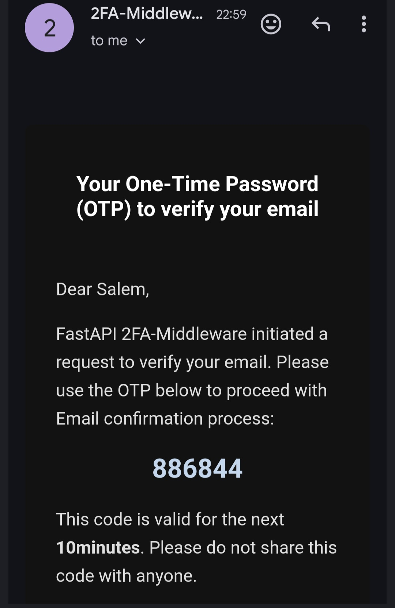

# 2FA Middleware Setup Guide

This guide walks you through setting up and using the 2FA Middleware project using Podman or Docker.

---

## 🔑 Prerequisites

Before you begin, make sure you have:

- A [Twilio](https://www.twilio.com/) account with an active phone number.
- A [Resend](https://resend.com/) account.

---

## ⚙️ Build and Start the Environment

### 1. Clone the Repository

```sh
git clone https://github.com/bhalshaker/2fa-middleware.git
cd 2fa-middleware
```

### 2. Create Environment File

Create a `.env` file by referring to the provided `example.env`.

### 3. Build the Environment

```sh
podman compose build
```

### 4. Start the Environment

```sh
podman compose up -d
```

---

## 🚀 Using the Application

### 1. Access Swagger UI

Open your browser and go to:

```
http://localhost:8000/docs
```

Log in using predefined usernames and passwords configured in Keycloak. Refer to the **Sample Users** table for credentials.

### 2. Create a User Record

Use `POST /user` in Swagger UI to insert a new user into the database. Swagger will generate the request automatically. If using an external client, replace the token with one generated for your session.

### 3. Verify User Record

Run `GET /user` to confirm the user was successfully created.

### 4. Update Mobile Number and/or Email

Use `PATCH /user` to update the user's mobile number and/or email. Enter a valid Bahraini mobile number and/or email address.

### 5. Confirm Mobile/Email via OTP

You will receive an OTP via SMS or email. Use `POST /user/verify-otp` to confirm the change. Set `otp_type` to either `email` or `mobile`.

#### 📧 Email OTP Example



#### 📱 SMS OTP Example


### 6. Generate TOTP Seed

Use `POST /user/generate-totp` to generate a TOTP seed. The service will return a QR code in base64 format.

### 7. Scan or Submit QR Code

Scan the QR code using an authenticator app (e.g., Google Authenticator, Microsoft Authenticator), or paste the base64 value into:

```
http://localhost:8000/static/TEST_QR.HTML
```

### 8. Verify TOTP

Use `POST /user/verify-totp` within 10 minutes. Set `is_new_seed` to `true` and enter the TOTP from your authenticator app. Upon success, the seed will be registered in the user's profile.

### 9. Test TOTP Verification

You can re-run `POST /user/verify-totp` with `is_new_seed` set to `false` to test valid and invalid TOTPs.

---

## 🧪 Notes

- Ensure your `.env` file is correctly configured before building.
- The application supports both email and SMS OTP flows.
- TOTP verification must be completed within 10 minutes of generation.

### Sample Users

| Username      | First   | Last    | Email                     | Password   |
| ------------- | ------- | ------- | ------------------------- | ---------- |
| ebrahim.salem | Ebrahim | Salem   | ebrahim.salem@example.com | Ebrahim123 |
| layla.hassan  | Layla   | Hassan  | layla.hassan@example.com  | Layla456   |
| omar.farouk   | Omar    | Farouk  | omar.farouk@example.com   | Omar789    |
| sara.nasr     | Sara    | Nasr    | sara.nasr@example.com     | Sara321    |
| ali.zayed     | Ali     | Zayed   | ali.zayed@example.com     | Ali654     |
| noor.khalid   | Noor    | Khalid  | noor.khalid@example.com   | Noor987    |
| yousef.amir   | Yousef  | Amir    | yousef.amir@example.com   | Yousef111  |
| mariam.fahmy  | Mariam  | Fahmy   | mariam.fahmy@example.com  | Mariam222  |
| hassan.tariq  | Hassan  | Tariq   | hassan.tariq@example.com  | Hassan333  |
| dina.rami     | Dina    | Rami    | dina.rami@example.com     | Dina444    |
| khaled.nabil  | Khaled  | Nabil   | khaled.nabil@example.com  | Khaled555  |
| rania.adel    | Rania   | Adel    | rania.adel@example.com    | Rania666   |
| tamer.sami    | Tamer   | Sami    | tamer.sami@example.com    | Tamer777   |
| huda.mansour  | Huda    | Mansour | huda.mansour@example.com  | Huda888    |
| zain.mahmoud  | Zain    | Mahmoud | zain.mahmoud@example.com  | Zain999    |
| nour.yassin   | Nour    | Yassin  | nour.yassin@example.com   | Nour000    |
| bassam.hatem  | Bassam  | Hatem   | bassam.hatem@example.com  | Bassam101  |
| lina.sherif   | Lina    | Sherif  | lina.sherif@example.com   | Lina202    |
| walid.fadel   | Walid   | Fadel   | walid.fadel@example.com   | Walid303   |
| salma.gamal   | Salma   | Gamal   | salma.gamal@example.com   | Salma404   |
